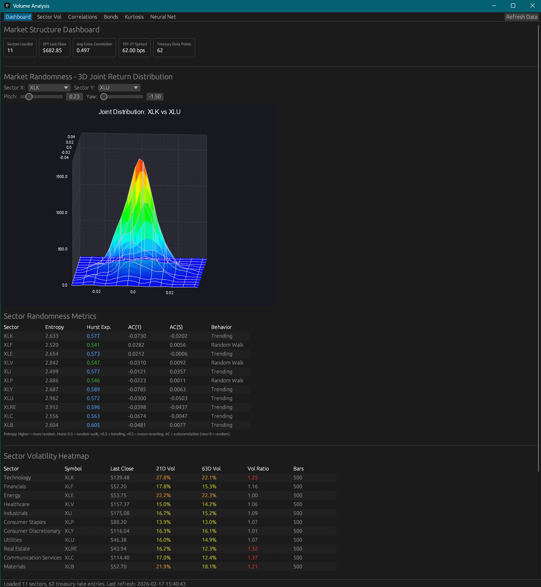
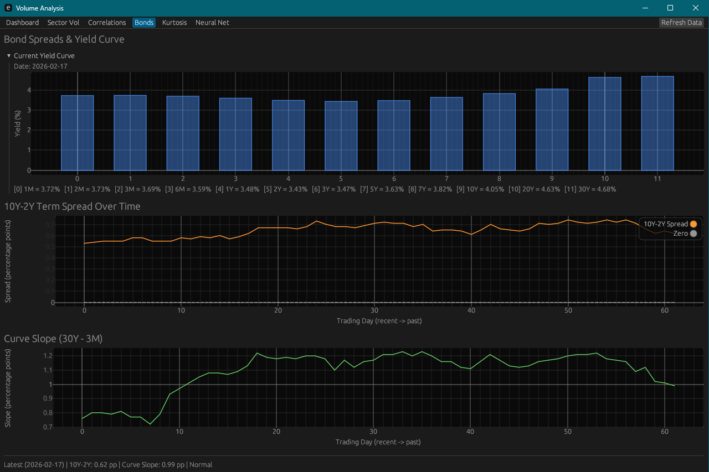
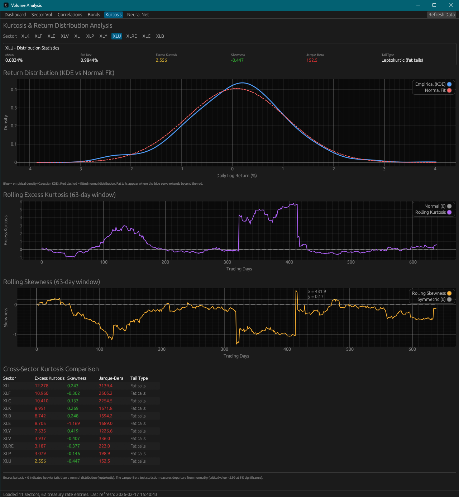
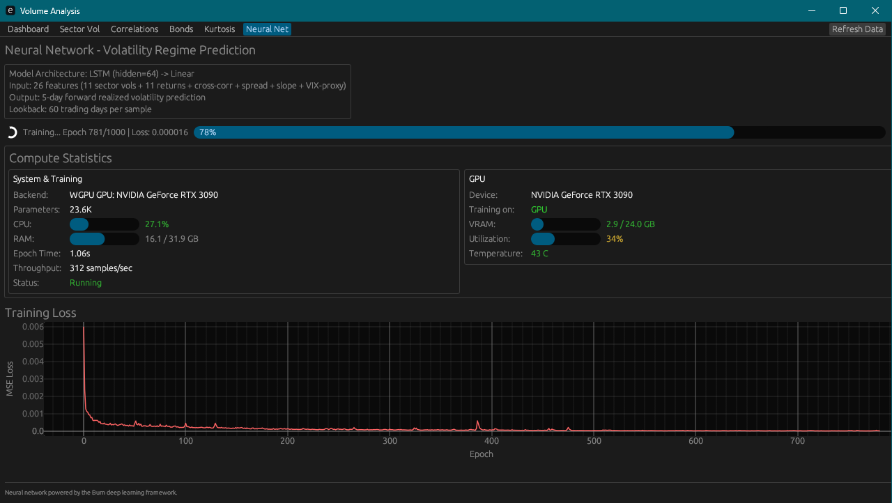

# Sector Volatility Analysis

A Rust desktop application for analyzing market structure by modeling sector volatility, cross-sector correlations, bond spreads, and training a local neural network for volatility regime prediction.

## Features

- **Sector Volatility Analysis**: Rolling historical and Parkinson volatility for 11 SPDR sector ETFs (XLK, XLF, XLE, XLV, XLI, XLP, XLY, XLU, XLRE, XLC, XLB)
- **Cross-Sector Correlation Matrix**: Pairwise Pearson correlation heatmap with average cross-correlation tracking
- **Bond Spread Analysis**: Treasury yield curve visualization, 10Y-2Y term spread, curve slope (30Y-3M), and inversion detection
- **Neural Network**: LSTM-based volatility regime prediction model trained locally using the Burn deep learning framework
- **Interactive Dashboard**: egui-powered GUI with tabbed navigation, interactive charts (pan/zoom), and real-time data refresh

## Data Sources

- **Yahoo Finance API** — Historical OHLCV data for sector ETFs and SPY benchmark
- **Financial Modeling Prep API** — Treasury rates across all maturities, sector performance snapshots

## Technology Stack

| Component | Technology |
|-----------|-----------|
| Language | Rust (2021 edition) |
| GUI | eframe + egui + egui_plot |
| Charts | egui_plot (line, bar, heatmap) |
| ML Framework | Burn (NdArray backend with autodiff) |
| Async | Tokio |
| HTTP | reqwest + yahoo_finance_api |

## Getting Started

### Prerequisites

- Rust toolchain (1.75+): https://rustup.rs
- Internet connection for API data fetching

### Build and Run

```bash
cargo run --release
```

The first build will take several minutes to compile all dependencies. Subsequent builds are fast.

### Usage

1. Launch the application
2. Click **Refresh Data** to fetch market data from Yahoo Finance and FMP
3. Navigate between tabs:
   - **Dashboard** — Overview heatmap with sector metrics
   - **Sector Vol** — Per-sector volatility charts with selector dropdown
   - **Correlations** — Cross-sector correlation matrix heatmap
   - **Bonds** — Yield curve and term spread analysis
   - **Neural Net** — Train the LSTM model and view predictions
4. On the Neural Net tab, click **Train Model** to start training (runs in a background thread)

### Data Caching

API responses are cached locally in the `cache/` directory to avoid redundant network requests. Cache freshness is 12 hours for market data and 1 hour for sector performance snapshots.

## Project Structure

```
src/
  main.rs           — Entry point, launches eframe window
  app.rs            — Application state, tab routing, data fetch orchestration
  config.rs         — API keys, sector symbols, NN hyperparameters
  data/
    yahoo.rs        — Yahoo Finance async client
    fmp.rs          — Financial Modeling Prep async client
    models.rs       — Core data structures (OHLCV, TreasuryRate, etc.)
    cache.rs        — Local JSON cache layer
  analysis/
    volatility.rs   — Historical vol, Parkinson vol, vol ratio
    cross_sector.rs — Correlation matrix, rolling correlation
    bond_spreads.rs — Term spread, yield curve, inversion detection
  nn/
    model.rs        — Burn LSTM model definition
    dataset.rs      — Feature engineering and sliding window dataset
    training.rs     — Training loop with progress reporting
  ui/
    dashboard.rs    — Sector heatmap and key metrics
    sector_view.rs  — Per-sector volatility charts
    correlation_view.rs — Correlation matrix heatmap
    bond_view.rs    — Yield curve and spread charts
    nn_view.rs      — Model training controls and predictions
```

## Analysis Details

### Volatility Metrics
- **Rolling Historical Vol**: Annualized standard deviation of log returns (21-day and 63-day windows)
- **Parkinson Volatility**: Range-based estimator using High/Low prices (more efficient than close-to-close)
- **Volatility Ratio**: Short-term / long-term vol ratio as a regime indicator (>1.0 = rising vol)

### Neural Network
- **Architecture**: LSTM (hidden=64) -> Linear (output=1)
- **Features (26)**: 11 sector rolling vols, 11 sector returns, avg cross-correlation, 10Y-2Y spread, curve slope, VIX proxy
- **Training**: Sliding 60-day windows, MSE loss, Adam optimizer, 80/20 chronological split
- **Output**: 5-day forward realized volatility prediction


## Example Images


#### Dashboard


#### Sector Volume Overview


#### US Bond Yield Curve


#### Sector Kurtosis


#### Neural Net Training
